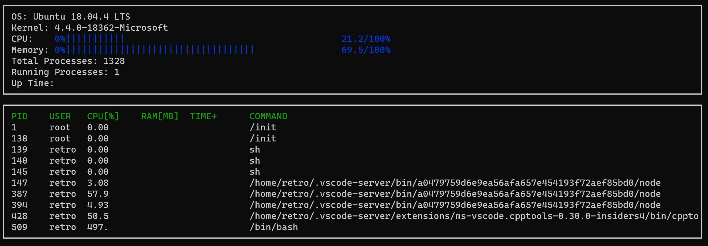

# CppND-System-Monitor

To launch the program on linux:
* install the dependencies introduced on the Init.md.
* Clone the project with `git clone https://github.com/TCMADCppND-System-Monitor-Project-Updated`.
* Build the project with make on the repository with `make build`.
* Start the program: `./build/monitor`

